# Google Cloud VPC Network Peering

This documentation provides a step-by-step guide to the process of setting up VPC peering between two VPCs located in different geographical regions within Google Cloud Platform (GCP). By following these steps, We will deploy an Nginx web server on one VM and connect to it from another VM using private IP addresses. 

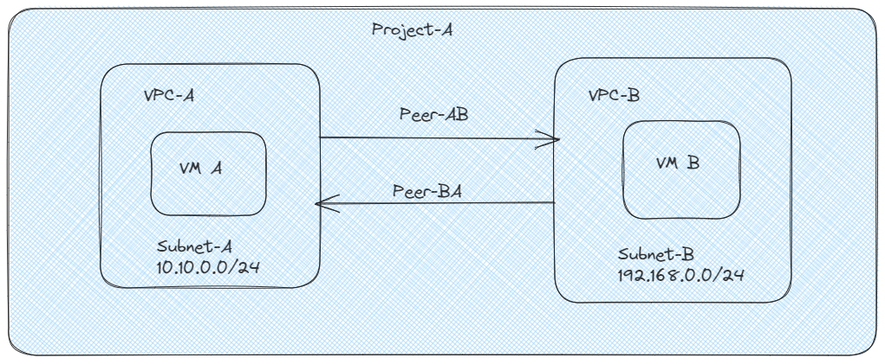

## VPC Peering
- Google Cloud VPC Nework Peering alows internal IP address connectivity across two Virtual Private Cloud (VPC) networks regardless of whether they belong to the same project or the same organization.
- VPC Network peering enables you to connect VPC networks so that workloads in different VPC networks can communicate internally.Traffic stays within Google's network and doesn't traverse the public internet.

## VPC Peering - Advantages
VPC Network Peerings gives you several advantages over using external IP addresses or VPNs to connect networks, including:

- Network Latency: Connectivity that uses only internal addresses provides lower latency than connectivity that uses external addresses.

- Network Security: Service owners do not need to have their services exposed to the public Internet and deal with its associated risks.

- Network Cost: Google Cloud charges egress bandwidth pricing for networks using external IPs to communicate even if the traffic is within the same zone. If however, the networks are peered they can use internal IPs to communicate and save on those egress costs. Regular network pricing still applies to all traffic.

## Step 1:Create a Google Cloud Project
 - Open the Google Cloud Console (console.cloud.google.com).
 - Click on the project dropdown at the top and select "New Project."
 - Follow the prompts to create a new project and remember its project ID.

## Step 2:Create a Custom vpc-a with vpc-a-subnet & Firewall Rules
  - In the left navigation pane, click "VPC Network" and then "VPC networks."
  - Click "Create VPC network."
  - Enter a name for your first VPC, choose the desired region, and click "Create."

  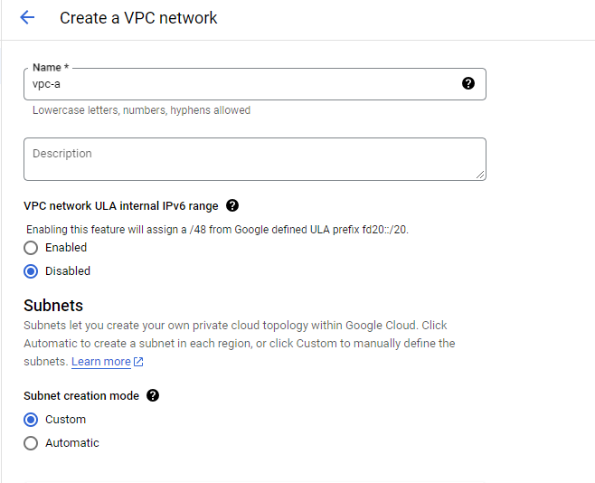

  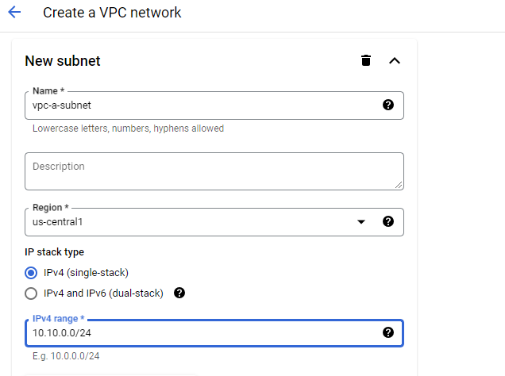

  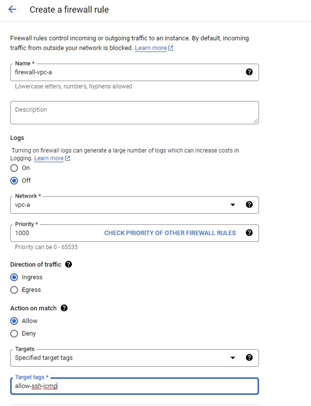

  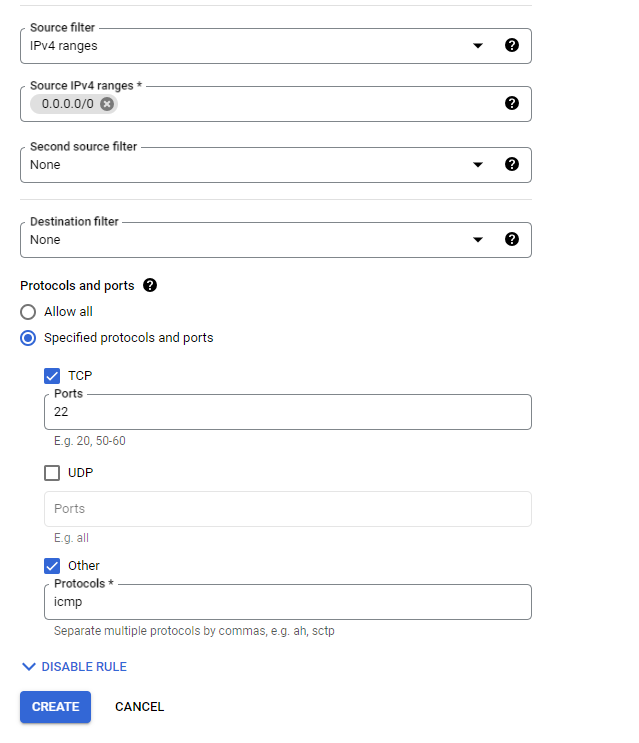

## Step 3:Create a Custom vpc-b with vpc-b-subnet & Firewall Rules
- Repeat steps from step #2 but enter different values in the fields as shown below.
  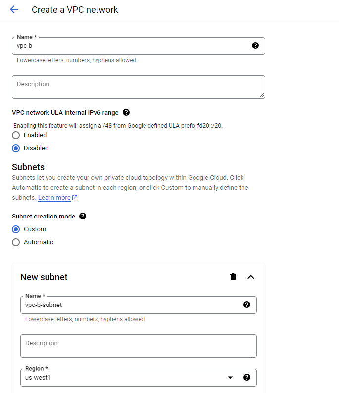

  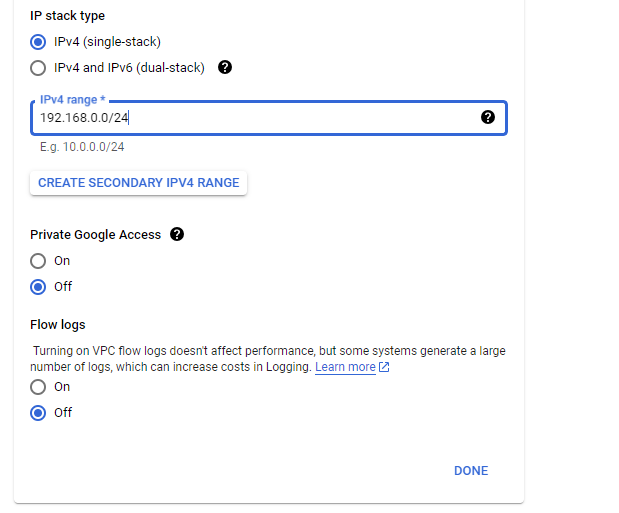

  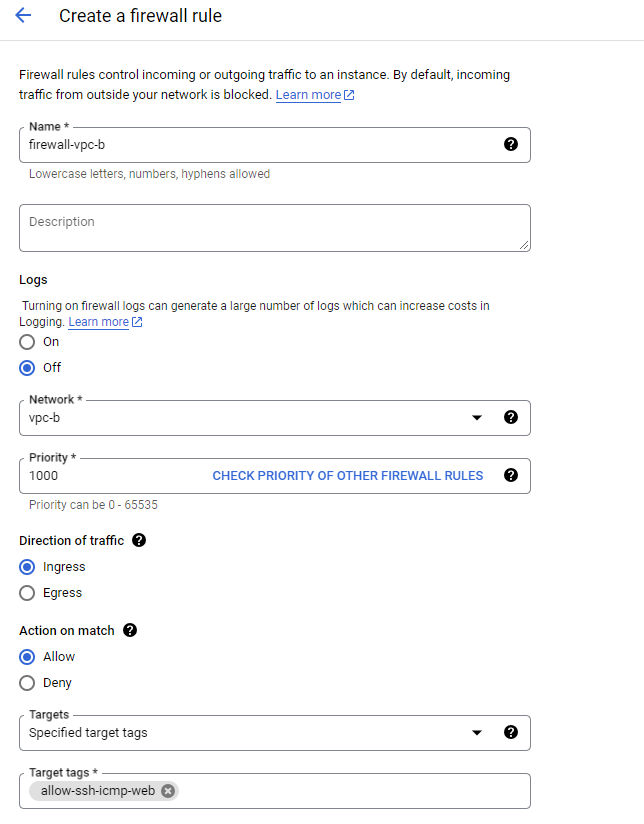

  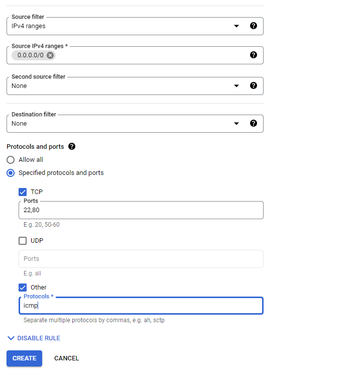

## Step 4:Create vm-a with proper networks tags
- 
  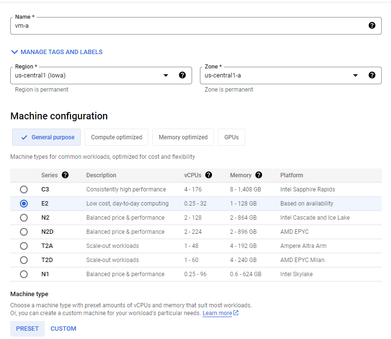
  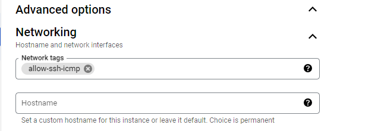
  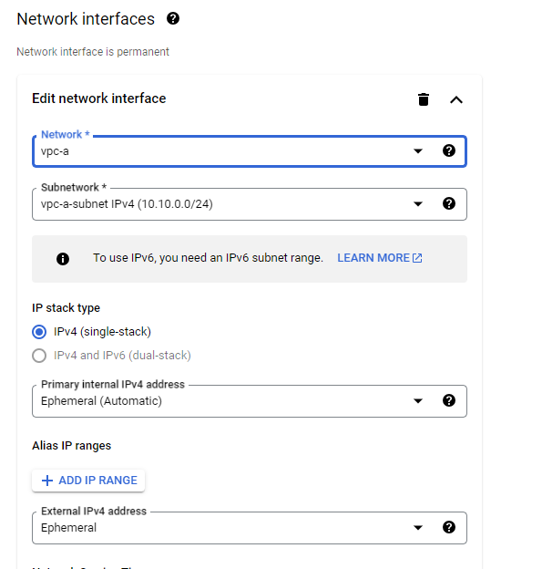
  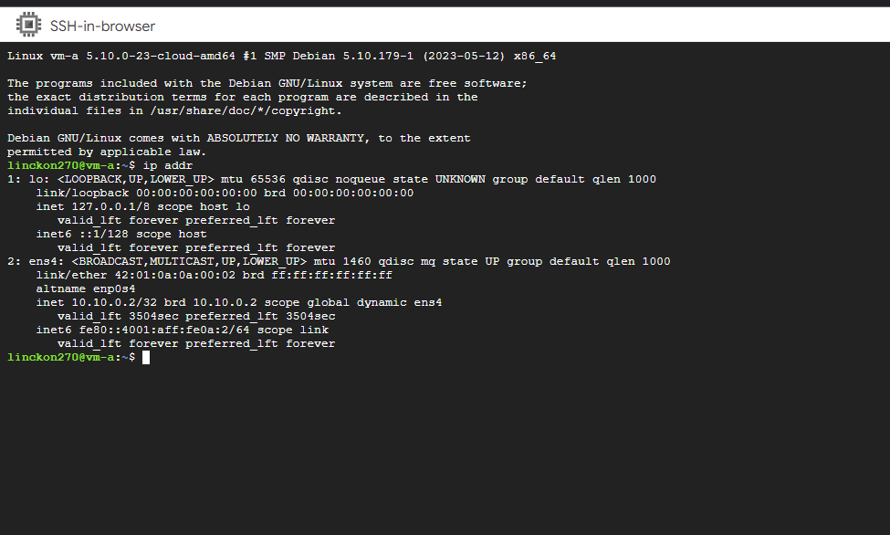

- after ssh the vm-a install telnet

  ```bash
    sudo apt update
    sudo apt install telnet
  ```

## Step 5:Create vm-b with proper network tags
- 
  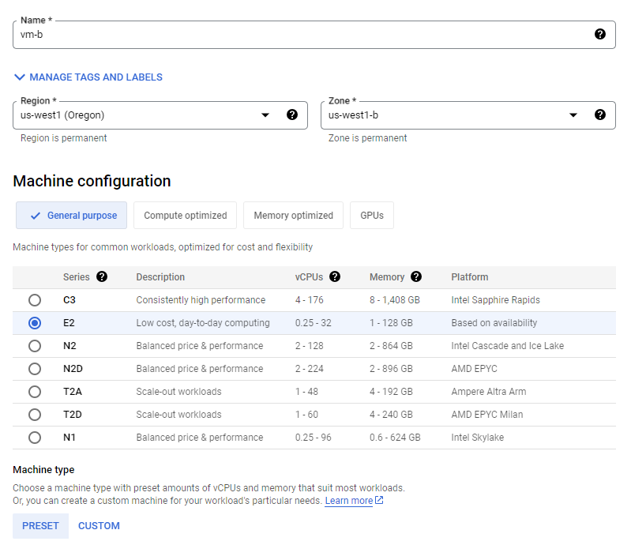
  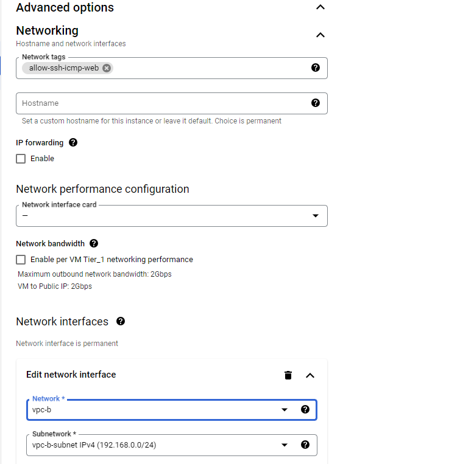
  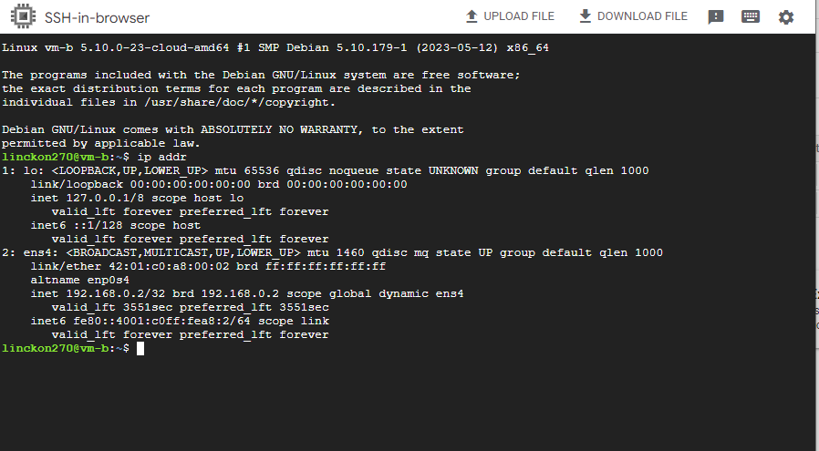

  - after ssh the vm-b install nginx

  ```bash
    sudo apt update
    sudo apt install nginx
  ```
  
## Step 6:Create VPC Network Peering connections (peering-ab and peering-ba)
- 
  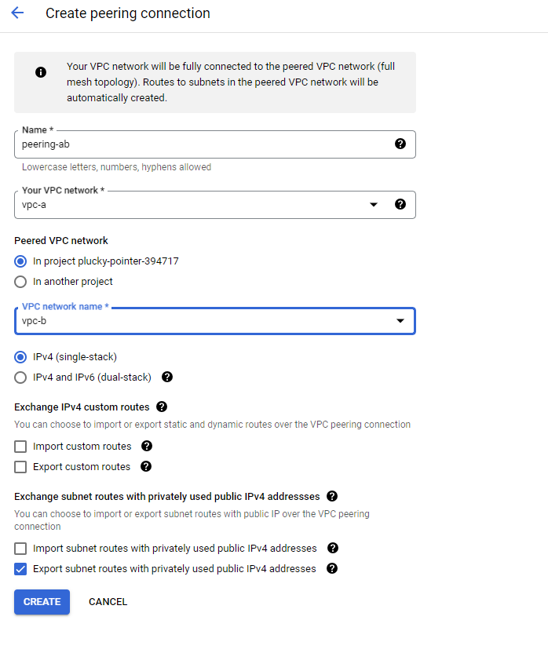
  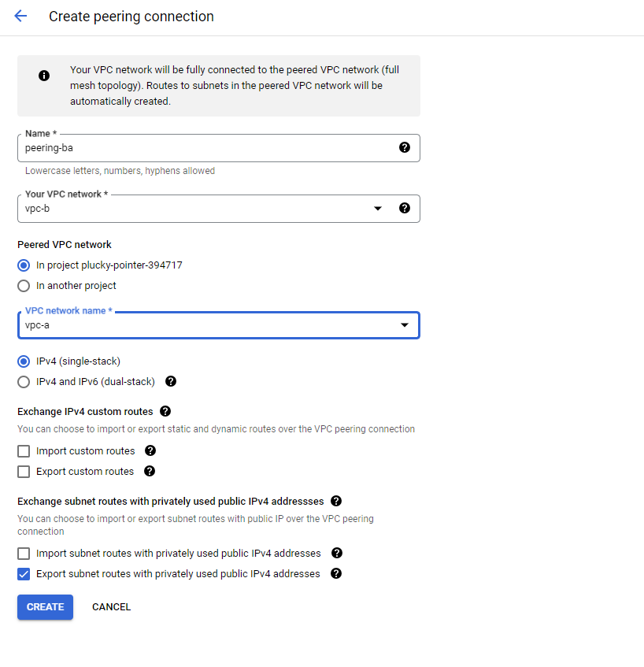

## Step 6:Test the Peering Connections(peering-ab and peering-ba)
- 
  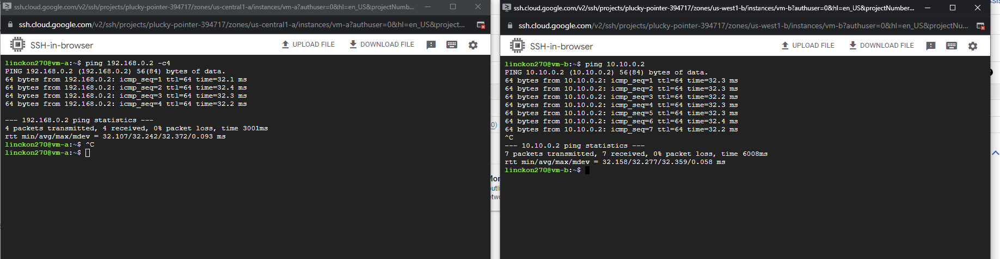
  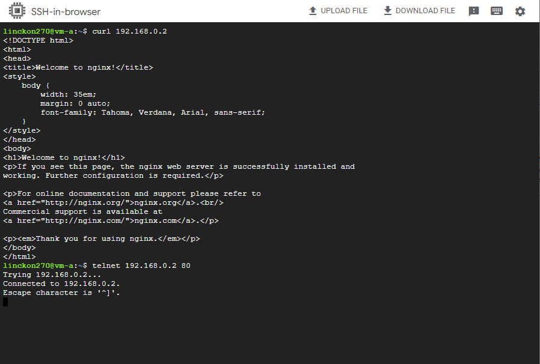

finally, we have created two separate VPCs in different geographical regions, set up a VM with Nginx in one VPC, and establish VPC peering to enable private IP communication between VMs across VPCs.


